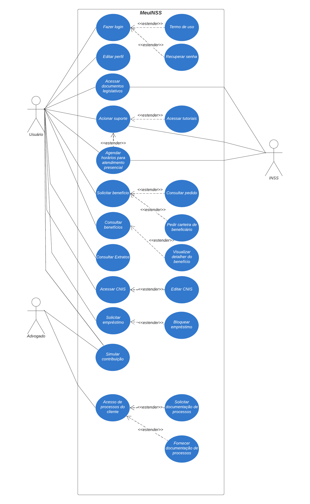
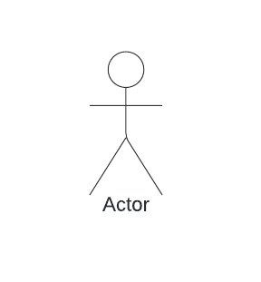
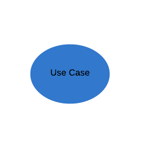
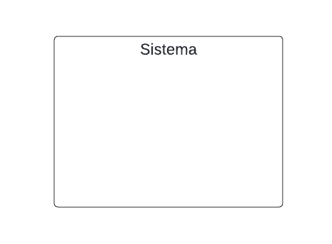
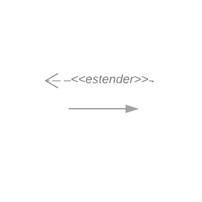

# Especificação suplementar

## Introdução

Os Casos de Uso, também conhecidos como diagramas comportamentais na notação da UML, são empregados para descrever ações específicas que um sistema, ou conjunto de sistemas (denominado "subject"), deve realizar em colaboração com um ou mais usuários externos (os "actors"). Esta técnica, fundamental na modelagem de sistemas, permite aos participantes de diversas áreas contribuir com suas perspectivas únicas, enriquecendo o processo de desenvolvimento.<a id="back1" href="#ref1">[1]</a>

Cada caso de uso busca proporcionar um resultado observável e valioso para os atores ou outros interessados, garantindo que as funcionalidades do sistema se alinhem efetivamente às necessidades dos usuários. Durante as sessões de desenvolvimento, ideias são livremente propostas e discutidas, com as mais adequadas sendo priorizadas para implementação, promovendo uma abordagem criativa e focada na resolução de problemas específicos dos usuários.
## Metodologia

## Diagrama de Casos de Uso
A figura 1 demonstra o diagrama de casos de uso.

 <strong>Figura 1:</strong> Diagrama de casos de uso  

Fonte: [Johnny Lopes](https://github.com/JohnnyLopess) & [Vitor Leonardo](https://github.com/vitorfleonardo) & [José Souza](https://github.com/JoseFilipi), 2024

### Legenda

 <strong>Tabela 1:</strong> Legenda do diagrama de casos de uso  

|Elemento|Nome|Função|
|:--:|:--:|:--:|
||Ator|Usuário do sistema, ou melhor, um tipo de usuário.<a id="back2" href="#ref2">[2]</a>|
||Elipse (Caso de uso)|É uma tarefa ou uma funcionalidade realizada pelo ator.<a id="back2" href="#ref2">[2]</a>|
||Retângulo (Sistema)|Usado para representar o sistema ou o bloco em análise. Ele envolve os casos de uso e atores relacionados.<a id="back3" href="#ref3">[3]</a>|
||Flecha (Relação)|As flechas são usadas para representar as relações ou interações entre atores e casos de uso.<a id="back3" href="#ref3">[3]</a>|

Fonte: [Johnny Lopes](https://github.com/JohnnyLopess), 2024

## Especificação de Casos de Uso
As tabelas abaixo demonstram a especificação dos casos de usos.

A tabela 2 demonstra como deve ser feito cada especificação.

 <strong>Tabela 2:</strong> Exemplo para especificação dos casos de uso  

|<strong>Código do caso de uso|<strong>Nome do caso de uso|
|:--|:--|
|<strong>Descrição|Explicação detalhada do que o caso de uso realiza, incluindo qualquer interação específica com o usuário ou o sistema.|
|<strong>Ator|Quem ou o que interage diretamente com o caso de uso|
|<strong>Fluxo básico|Sequência principal de passos que descreve a interação padrão do ator com o sistema para atingir o objetivo do caso de uso.|
|<strong>Fluxos alternativos|Variantes do fluxo básico que ocorrem sob condições específicas, oferecendo caminhos alternativos ou adicionais.|
|<strong>Fluxo de exeção|Descreve o que acontece quando ocorre um erro ou uma situação excepcional durante a execução do caso de uso.|
|<strong>Pré-condições|Condições que devem ser verdadeiras ou cumpridas antes da execução do caso de uso.|
|<strong>Pós-condições|Estado do sistema ou condições que são verdadeiras após a conclusão do caso de uso.|
|<strong>Data da criação|Data em que o caso de uso foi criado ou documentado.|
|<strong>Rastreabilidade|Ligações do caso de uso a requisitos específicos.|

Fonte: [Johnny Lopes](https://github.com/JohnnyLopess), 2024

### UC02 - Consultar benefícios

 <strong>Tabela 3:</strong> Consultar benefícios  

|<strong>UC02|<strong>Consultar benefícios|
|:--|:--|
|<strong>Descrição|Permite que o usuário visualize informações detalhadas sobre os benefícios aos quais tem direito no sistema MeuINSS.|
|<strong>Ator|Usuário|
|<strong>Fluxo básico|1. Usuário acessa a opção "Benefícios" na tela inicial do aplicativo. 2. O usuário é direcionado para uma página de seleção de benefícios. 3. Usuário seleciona um benefício específico. 4. O sistema exibe as informações detalhadas do benefício selecionado.|
|<strong>Fluxos alternativos|1. Usuário seleciona a opção de ver todos os benefícios, o sistema lista todos os benefícios aos quais o usuário tem direito.|
|<strong>Fluxo de exeção|1. Se o sistema MeuINSS estiver fora do ar, o usuário recebe uma mensagem de erro informando que o serviço não está disponível no momento.|
|<strong>Pré-condições|1. Usuário deve estar autenticado no sistema MeuINSS com uma conta GOV.br regular. 2. Usuário deve ter pelo menos 1 ano de contribuição. 3. O aplicativo MeuINSS deve estar instalado e o dispositivo conectado à internet.|
|<strong>Pós-condições|O usuário obtém as informações necessárias sobre o benefício selecionado.|
|<strong>Data da criação|16/05/2024|
|<strong>Rastreabilidade|RE08,RE14,RE15|

Fonte: [Johnny Lopes](https://github.com/JohnnyLopess), 2024

### UC03 - Solicitar benefício

 <strong>Tabela 4:</strong> Solicitar benefícios  

| <strong>UC03 | <strong>Solicitar benefício |
|:--|:--|
|<strong>Descrição| Permite que o usuário solicite os benefícios aos quais tem direito nosistema MeuINSS. |
| <strong>Ator | Usuário |
| <strong>Fluxo básico | 1. Usuário acessa a opção "Benefícios" na tela inicial do aplicativo. 2. O usuário é direcionado para uma página de seleção de benefícios. 3. Usuário seleciona um benefício específico para poder emitir. 4. O sistema exibe um formulário para preencher informações do benefício selecionado para a emissão. 5. O sistema armazena e protocola a emissão. |
| <strong>Fluxos alternativos | 1. Se o formulário não for preenchido corretamente ,o sistema alerta o usuário e não permite o envio da solicitação até que todas as informações sejam fornecidas corretamente. |
| <strong>Fluxo de exceção | 1. Se ocorrer um erro no envio da solicitação, o sistema deve apresentar uma mensagem de erro e permitir que o usuário tente enviar novamente. |
| <strong>Pré-condições | 1. Usuário deve estar autenticado no sistema MeuINSS com uma conta GOV.br regular.  2. Usuário deve ter pelo menos 1 ano de contribuição.  3. O aplicativo MeuINSS deve estar instalado e o dispositivo conectado à internet. 4. O usuário deve estar apto a receber o benefício selecionado. |
| <strong>pós-condições | O usuário consegue realizar a emissão da solicitação garantindo o seu benefício. |
| <strong>Data da criação | 16/05/2024 |
| <strong>Rastreabilidade | RE15, RE22, RE24, RE25 |

Fonte: [Paulo Borba](https://github.com/paulohborba), 2024

## Referências Bibliográficas

> <a id="ref1" href="#back1">1.</a> SERRANO, M. SERRANO, M (s.d.). Requisitos - Aula 13. UnB GAMA. 

> <a id="ref2" href="#back2">2.</a> DEV MEDIA. O que é UML e Diagramas de Caso de Uso: Introdução Prática à UML. Disponível em: [https://www.devmedia.com.br/o-que-e-uml-e-diagramas-de-caso-de-uso-introducao-pratica-a-uml/23408](https://www.devmedia.com.br/o-que-e-uml-e-diagramas-de-caso-de-uso-introducao-pratica-a-uml/23408). Acesso em: 16 Mai. 2024.

> <a id="ref3" href="#back3">3.</a> Requisitos de Software. Economia DF (2023.2). Disponível em: [https://requisitos-de-software.github.io/2023.2-Economia-DF/modelagem/casos-de-uso/#introducao](https://requisitos-de-software.github.io/2023.2-Economia-DF/modelagem/casos-de-uso/#introducao). Acesso em: 16 Mai. 2024.

## Bibliografia
> </a> Requisitos de Software. Economia DF (2023.2). Disponível em: [https://requisitos-de-software.github.io/2023.2-Economia-DF/](https://requisitos-de-software.github.io/2023.2-Economia-DF/). Acesso em: 16 Mai. 2024.

> </a> Pimentel, Andrey Ricardo. Projeto de Software Usando a UML. Apostila para Curso de Projeto de Sistemas Orientado a Objetos Usando a UML. Disponível em: [https://aprender3.unb.br/mod/resource/view.php?id=1218850](https://aprender3.unb.br/mod/resource/view.php?id=1218850). Acesso em: 16 Mai. 2024.</a>

## Histórico de Versão
| Versão | Data | Descrição | Autor(es) | Data de revisão | Revisor(es) |
| :-: | :-: | :-: | :-: | :-: | :-: |
| `1.0` | 13/05/2024 | Versão inicial da pagina de Casos de Uso. | [Vitor Feijó](https://github.com/vitorfleonardo) & [Johnny Lopes](https://github.com/JohnnyLopess) & [José Filipi](https://github.com/JoseFilipi) | | | 
| `1.1` | 16/05/2024 | Adição de conteúdo à página. | [Johnny Lopes](https://github.com/JohnnyLopess) | | | 
