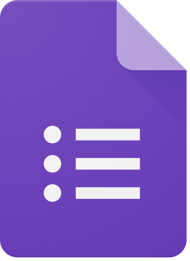

# Ferramentas
## Introdução
Nesta seção, destacamos a seleção de ferramentas realizada pelo nosso grupo para potencializar o desenvolvimento do projeto. Nosso objetivo primordial é aprimorar a eficiência operacional, elevar a qualidade do trabalho produzido e facilitar a comunicação entre todos os membros da equipe. Através da adoção estratégica dessas ferramentas, buscamos não apenas otimizar os processos de gestão, mas também promover uma colaboração sinérgica que resulte em um projeto bem-sucedido e eficiente.

 <strong> Tabela 1:</Strong> Ferramentas utilizadas <gitbr>

|Ferramenta|Nome|Descrição|
|:--|:--|:--|
||<strong> [GitHub](#anchor_1)|Plataforma utilizada para organizar e versionar os artefatos.
||<strong> [Micrsoft Teams](#anchor_2)| Plataforma utilizada para fazer a gravação das reuniões e das apresentações. 
||<strong>[WhatsApp](#anchor_3)|Principal canal de comunicação da equipe.
||<strong>[Discord](#anchor_4)|Canal de comunicação e transferência de arquivos.
||<strong>[Mkdocs](#anchor_5)|Criação e edição da documentação.
||<strong>[Visual Studio Code](#anchor_6)|Edição dos arquivos da documentação.
||<strong>[Trello](#anchor_7)|Organização das tarefas e assuntos para as reuniões.
||<strong>[Youtube](#anchor_8)|Plataforma utilizada para postagem da gravação das reuniões e das apresentações.
||<strong>[Figma](#anchor_9)|Criação de protótipos.
||<strong>[Drawio](#anchor_10)|Criação de diagramas.|
||<strong>[Canva](#anchor_11)|Criação da Rich picture.|
||<strong>[Google Forms](#anchor_12)|Criação do Formulário.|
||<strong>[Google Planilhas](#anchor_13)|Criação de planilhas.|
||<strong>[LucidChart](#anchor_14)|Criação de diagramas.|
||<strong>[This Person Doesn't Exist](#anchor_15)|Criação de imagens para as personas.|

<b>Autor:</b> [Johnny Lopes](https://github.com/JohnnyLopess), 2024

## Referências Bibliográficas

> <a id="QT1" href="#anchor_1">1.</a> GitHub. Disponível em: https://github.com. Acesso em: 28 de mar. 2024.

> <a id="QT2" href="#anchor_2">2.</a> Microsoft Teams. Disponível em: https://teams.microsoft.com. Acesso em: 28 de mar. 2024.

> <a id="QT3" href="#anchor_3">3.</a> WhatsApp. Disponível em: https://www.whatsapp.com/?lang=pt_BR. Acesso em: 28 de mar. 2024.

> <a id="QT4" href="#anchor_4">4.</a> Discord. Disponível em: https://discord.com/pt_BR. Acesso em: 28 de mar. 2024.

> <a id="QT5" href="#anchor_5">5.</a> Discord. Disponível em: https://www.mkdocs.org/. Acesso em: 28 de mar. 2024.

> <a id="QT6" href="#anchor_6">6.</a> Visual Studio Code. Disponível em: https://code.visualstudio.com/. Acesso em: 28 de mar. 2024.

> <a id="QT7" href="#anchor_7">7.</a> Trello. Disponível em: https://trello.com/pt-BR. Acesso em: 28 de mar. 2024.

> <a id="QT8" href="#anchor_8">8.</a> Youtube. Disponível em: https://www.youtube.com/. Acesso em: 28 de mar. 2024.

> <a id="QT9" href="#anchor_9">9.</a> Figma. Disponível em: https://www.figma.com/. Acesso em: 28 de mar. 2024.

> <a id="QT10" href="#anchor_10">10.</a> Drawio. Disponível em: https://app.diagrams.net/. Acesso em: 28 de mar. 2024.

> <a id="QT11" href="#anchor_11">11.</a> Canva. Disponível em: https://www.canva.com/. Acesso em: 31 de mar. 2024.

> <a id="QT12" href="#anchor_12">12.</a> Google Forms. Disponível em: https://www.google.com/intl/pt-BR/forms/about/. Acesso em: 09 de abr. 2024.

> <a id="QT13" href="#anchor_13">13.</a> Google Planilhas. Disponível em: https://www.google.com/intl/pt-BR/sheets/about/. Acesso em: 09 de abr. 2024.

> <a id="QT14" href="#anchor_14">14.</a> Lucidchart. Disponível em: https://www.lucidchart.com/pages/pt. Acesso em: 09 de abr. 2024.

> <a id="QT15" href="#anchor_15">15.</a> This Person Doesn't Exist. Disponível em: https://this-person-does-not-exist.com/pt. Acesso em: 09 de abr. 2024.

## Histórico de Versão
| Versão | Data | Descrição | Autor(es) | Data de revisão | Revisor(es) |
| :-: | :-: | :-: | :-: | :-: | :-: |
| `1.0` | 28/03/2024  | Versão inicial de documento. | [Johnny Lopes](https://github.com/JohnnyLopess) | 30/03/2024 | [Paulo Borba](https://github.com/paulohborba) |
| `1.1` | 29/03/2024  | Correção no tamanho das imagens. | [Johnny Lopes](https://github.com/JohnnyLopess) | 31/03/2024 | [Paulo Borba](https://github.com/paulohborba) |
| `1.2` | 09/04/2024  | Adição de novas ferramentas. | [Johnny Lopes](https://github.com/JohnnyLopess) | 10/04/2024 | [Paulo Borba](https://github.com/paulohborba) |
| `1.3`  | 13/04/2024 | Correção das referencias e citações| [Amanda Campos](https://github.com/acamposs) | 14/04/2024 | [Paulo Borba](https://github.com/paulohborba) |
|`1.4` | 04/07/2024 | Alteração do documento. |[Paulo Borba](https://github.com/paulohborba) | 04/07/2024 | [Amanda Campos](https://github.com/acamposs)|