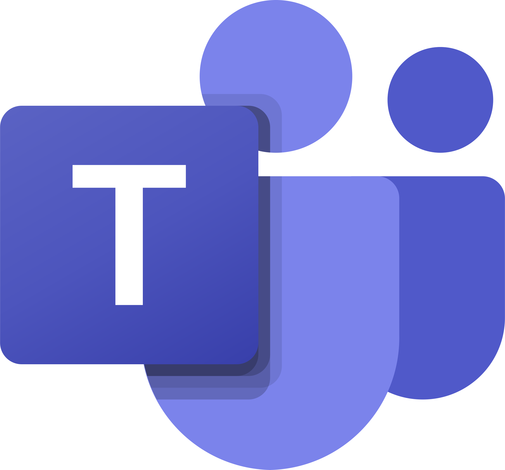

# Ferramentas
## Introdução
Nesta página, apresentamos a seleção de ferramentas feita pelo grupo. Nosso objetivo é otimizar o desenvolvimento, aprimorar a qualidade do trabalho, facilitar a comunicação entre os membros da equipe e permitir uma gestão eficaz, resultando em um projeto bem-sucedido e eficiente.

 <strong> Tabela 1:</Strong> Ferramentas utilizadas <gitbr>

|Ferramenta|Nome|Descrição|
|:--|:--|:--|
||<strong> GitHub|Plataforma utilizada para organizar e versionar os artefatos.[1]|
||<strong>Micrsoft Teams| Plataforma utilizada para fazer a gravação das reuniões e das apresentações.[2] |
||<strong>WhatsApp|Principal canal de comunicação da equipe.[3]|
||<strong>Discord|Canal de comunicação e transferência de arquivos.[4]|
||<strong>Mkdocs|Criação e edição da documentação.[5]|
||<strong>Visual Studio Code|Edição dos arquivos da documentação.[6]|
||<strong>Trello|Organização das tarefas e assuntos para as reuniões.[7]|
||<strong>Youtube|Plataforma utilizada para postagem da gravação das reuniões e das apresentações.[8]|
||<strong>Figma|Criação de protótipos.[9]|
||<strong>Drawio|Criação de diagramas.[10]|

<b>Fonte</b> - [Johnny Lopes](https://github.com/JohnnyLopess), 2024

## Referências

[1] GitHub. Disponível em: [https://github.com](https://github.com). Acesso em: 28 de mar. 2024.

[2] Microsoft Teams. Disponível em: [https://teams.microsoft.com](https://teams.microsoft.com). Acesso em: 28 de mar. 2024.

[3] WhatsApp. Disponível em: [https://www.whatsapp.com/?lang=pt_BR](https://www.whatsapp.com/?lang=pt_BR). Acesso em: 28 de mar. 2024.

[4] Discord. Disponível em: [https://discord.com/pt_BR](https://discord.com/pt_BR). Acesso em: 28 de mar. 2024.

[5] Discord. Disponível em: [https://www.mkdocs.org/](https://www.mkdocs.org/). Acesso em: 28 de mar. 2024.

[6] Visual Studio Code. Disponível em: [https://code.visualstudio.com/](https://code.visualstudio.com/). Acesso em: 28 de mar. 2024.

[7] Trello. Disponível em: [https://trello.com/pt-BR](https://trello.com/pt-BR). Acesso em: 28 de mar. 2024.

[8] Youtube. Disponível em: [https://www.youtube.com/](https://www.youtube.com/). Acesso em: 28 de mar. 2024.

[9] Figma. Disponível em: [https://www.figma.com/](https://www.figma.com/). Acesso em: 28 de mar. 2024.

[10] Drawio. Disponível em: [https://app.diagrams.net/](https://app.diagrams.net/). Acesso em: 28 de mar. 2024.

## Histórico de Versão
| Versão | Data | Descrição | Autor(es) | Data de revisão | Revisor(es) |
| :-: | :-: | :-: | :-: | :-: | :-: |
| `1.0` | 28/03/2024  | Versão inicial de documento. | [Johnny Lopes](https://github.com/JohnnyLopess) |  |  |
| `1.1` | 29/03/2024  | Correção no tamanho das imagens. | [Johnny Lopes](https://github.com/JohnnyLopess) |  |  |